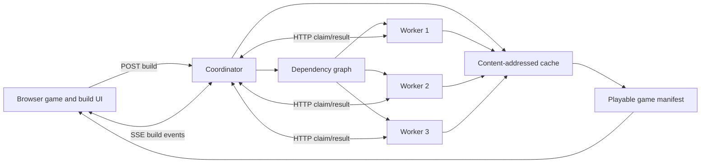

# ForgeGrid

ForgeGrid is a playable distributed build-system demo.

A visitor chooses a game world, weapon, and enemy profile. ForgeGrid converts
those inputs into a dependency graph, distributes real CPU and asset-processing
work across three networked worker processes, stores results in a
content-addressed cache, bundles a playable artifact, and loads that exact
artifact into a browser game.

## Watch the demo

https://github.com/user-attachments/assets/c8b4dd5b-3791-40d0-b8d3-fa762ce87cbc

**[Run it locally](#quick-start)**

The recording uses the real local system: three operating-system worker
processes, measured wall-clock timings, an actual worker termination, and the
playable artifact produced by the build.

The project is designed to make infrastructure understandable before someone
reads the code:

1. Customize a game.
2. Watch workers build it.
3. Play the result.
4. Repeat the same build and see every task return from cache.
5. Stop a worker during a build and watch its unfinished task move elsewhere.

## Quick start

Requirements: Node.js 22 or newer. There are no third-party runtime
dependencies.

On macOS, double-click `start-forgegrid.command`. It starts the system, waits
for the coordinator, and opens the playable demo automatically.

Or start it from a terminal:

```bash
npm start
```

Open [http://127.0.0.1:8000](http://127.0.0.1:8000).

The coordinator starts three worker processes automatically. To run the same
architecture as separate containers:

```bash
docker compose up --build
```

The local demo uses a showcase-sized real workload so worker progress remains
visible for a few seconds. Set `FORGEGRID_WORK_SCALE=1` when starting standalone
workers if you want the fastest execution instead.

## What is real

The build visualization is driven by coordinator events, not browser timers.

- Workers are separate operating-system processes.
- Workers register, heartbeat, claim tasks, report progress, and return
  artifacts over HTTP.
- The coordinator computes SHA-256 action keys from canonical task inputs and
  dependency keys.
- Cache artifacts are written atomically and addressed by those keys.
- Script compilation generates and compresses combat lookup tables.
- Shader compilation expands and links procedural shader variants.
- Texture processing creates and compresses a procedural RGBA atlas.
- Audio processing synthesizes and encodes a deterministic sound bank.
- Level packaging generates deterministic arena geometry.
- Navigation generation builds and compresses a pathfinding field.
- Game bundling combines verified dependency artifacts into a playable
  manifest.
- The recovery demo tells Worker 2 to terminate its real process. The
  coordinator requeues its unfinished task, and the local launcher or container
  runtime starts a replacement.
- The worker comparison runs the same cold build twice with caching disabled:
  once with one process and once with three. Both bars use actual wall-clock
  time and no simulated delay.
- The cache comparison separately measures a cold build and an identical
  rebuild so parallelism and work avoidance are not mixed together.

The public interface accepts curated presets rather than arbitrary uploaded
code. That keeps the demonstration safe to host while preserving real build
behavior.

## Architecture



The task graph contains seven actions:

```text
compile-scripts ───────┐
compile-shaders ───────┤
process-textures ──────┤
process-audio ─────────┼─> bundle-game
package-level ─────────┤
generate-navigation ───┘
```

The first six tasks are independent and may run concurrently. The final
bundle cannot start until all dependency artifacts are completed or restored
from cache.

## Worker scaling benchmark

The interface includes a speed test that performs two real cold builds with
caching disabled. On an Apple M2 test machine:

```json
{
  "oneWorkerMs": 3416,
  "threeWorkersMs": 1644,
  "percentReduction": 51.9,
  "speedup": 2.08
}
```

Run the same controlled comparison from a terminal:

```bash
npm run benchmark:workers
```

Results vary with processor load and hardware. The benchmark reports the
measured result rather than enforcing a marketing target.

## Cache behavior

Every action key contains:

- Task implementation version
- Task name
- Canonically serialized direct inputs
- Content keys of dependency outputs

Changing only the weapon invalidates scripts, shaders, audio, and the final
bundle. Texture, level, and navigation artifacts remain reusable.

An example local benchmark:

```json
{
  "cold": {"executedTasks": 7, "cacheHits": 0},
  "warm": {"executedTasks": 0, "cacheHits": 7},
  "incremental": {"executedTasks": 4, "cacheHits": 3}
}
```

Run the benchmark on your own machine:

```bash
npm run benchmark
```

Timing depends on hardware. The task counts and invalidation behavior are the
important correctness signals.

## Failure recovery

Enable **Demonstrate recovery** before building.

When Worker 2 starts a task, the coordinator marks that one assignment for the
failure demonstration. Worker 2 then terminates its own process. The
coordinator:

1. Marks the worker offline.
2. Returns its unfinished task to the front of the queue.
3. Assigns that same task to another available worker.
4. Starts a replacement Worker 2.
5. Completes the build without losing finished work.

Tasks stop retrying after three failures, preventing an invalid task from
cycling forever.

Remote workers use heartbeat leases, so a worker that disappears without a
clean process-exit notification is also detected.

## Running a worker on another machine

Start the coordinator without local workers:

```bash
FORGEGRID_AUTO_WORKERS=false npm start
```

On a machine that can reach the coordinator:

```bash
FORGEGRID_WORKER_ID=worker-remote-1 \
FORGEGRID_COORDINATOR_URL=http://COORDINATOR_HOST:8000 \
node server/worker.js
```

The default demo runs everything on one computer for convenience. The protocol
does not depend on local inter-process communication or a shared worker
filesystem.

## Game controls

- Move: `WASD` or arrow keys
- Fire: hold the pointer or press `Space`
- Mobile: directional and fire buttons below the game

The game is intentionally small. Its job is to make each build artifact
immediately testable, not to compete with a production game.

## Testing

```bash
npm run check
npm test
npm run benchmark
npm run benchmark:workers
```

The test suite covers:

- Canonical hashing and input-order independence
- Safe content-addressed storage
- Dependency scheduling
- Cold and warm builds
- Partial cache invalidation
- True one-worker versus three-worker process comparison
- Worker-loss requeue behavior
- HTTP health, presets, and static delivery
- Full coordinator-to-worker network builds
- Process termination and recovery

CI runs syntax checks, unit tests, network integration tests, and the
cold/warm/incremental benchmark.

## Repository layout

```text
public/                  Playable game and recruiter-facing interface
server/server.js         HTTP coordinator, SSE, worker lifecycle
server/coordinator.js    Build graph, queue, cache, retries, worker leases
server/worker.js         Standalone network worker process
server/task-definitions.js
                         Real build workloads and playable manifest
test/                    Unit and end-to-end network tests
scripts/benchmark.js     Cold, warm, and incremental benchmark
scripts/worker-comparison.js
                         One-worker and three-worker cold-build comparison
compose.yaml             Separate coordinator and worker containers
```

## Resume-level description

> Built a distributed game-build platform with networked workers,
> content-addressed caching, dependency-aware scheduling, and automatic task
> recovery after worker failure; exposed the system through a playable browser
> game and live build evidence.

## Limitations

- This is an educational build system, not a replacement for Unreal Build Tool
  or a production remote-execution platform.
- Workers currently trust the coordinator and are not authenticated.
- Build tasks use curated presets and do not execute user-submitted code.
- The coordinator stores state in memory, while cached artifacts persist on
  disk.

Those boundaries are deliberate. They keep the demo understandable and safe
while leaving clear directions for authentication, durable scheduling state,
worker sandboxing, and multi-coordinator replication.
