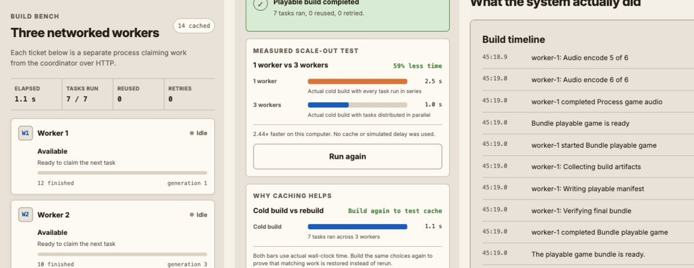
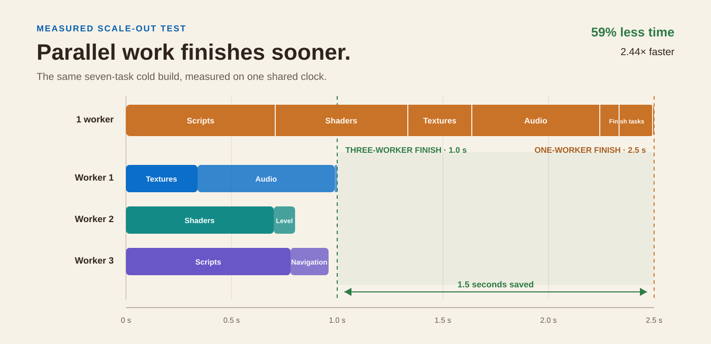
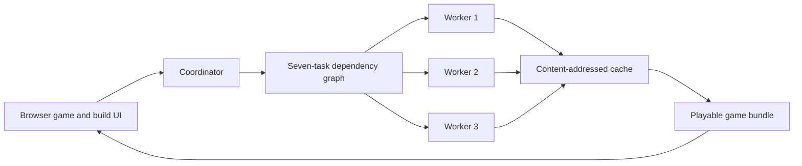

# ForgeGrid

**A playable distributed build system.**

ForgeGrid turns a few game choices into a seven-task build. Three worker
processes compile and package the game, cached work is reused, failed workers
are replaced, and the exact artifact they produce can be played in the browser.



## Results at a glance

| Test | Measured result |
| --- | ---: |
| Cold build: one worker vs. three workers | **2.5 s → 1.0 s** |
| Wall-clock reduction | **59% less time** |
| Parallel speedup | **2.44× faster** |
| Identical second build | **7 of 7 tasks reused from cache** |
| Worker failure | **Task reassigned; build completes** |

The worker comparison runs the same cold build twice with caching disabled and
no simulated delay. Results vary with hardware and background load.



## Try it locally

Requirements: Node.js 22 or newer. There are no third-party runtime
dependencies.

On macOS, double-click `start-forgegrid.command`.

Or run:

```bash
npm start
```

Then open [http://127.0.0.1:8000](http://127.0.0.1:8000).

Once it is running:

1. Choose a world, weapon, and enemy style.
2. Build the game and watch three workers claim tasks.
3. Play the artifact they produced.
4. Build it again to see all seven tasks return from cache.
5. Enable **Demonstrate recovery** to stop Worker 2 and reassign its task.
6. Use the **Worker scaling lab** to compare any fleet size from 1 to 8.

## How it works

1. The coordinator converts the game choices into a dependency graph.
2. Three separate worker processes claim independent tasks over HTTP.
3. Completed artifacts are stored in a SHA-256 content-addressed cache.
4. The final bundle starts after its dependencies finish or return from cache.
5. The browser loads and plays that verified bundle.



## Engineering details

<details>
<summary><strong>What is real?</strong></summary>

- Workers are separate operating-system processes.
- Workers register, heartbeat, claim tasks, report progress, and return
  artifacts over HTTP.
- The UI is driven by coordinator events rather than browser timers.
- Script, shader, texture, audio, level, and navigation tasks perform real,
  deterministic CPU and asset-processing work.
- Cache keys include each task's inputs, implementation version, and dependency
  outputs.
- The final playable manifest contains checksums for the inputs that created it.

</details>

<details>
<summary><strong>What happens when a worker fails?</strong></summary>

The recovery demo terminates Worker 2 while it owns a task. The coordinator:

1. Marks the worker offline.
2. Returns its unfinished task to the queue.
3. Assigns the task to another available worker.
4. Starts a replacement Worker 2.
5. Completes the build without losing finished work.

Remote workers are also detected through heartbeat leases.

</details>

<details>
<summary><strong>Benchmarks and tests</strong></summary>

```bash
npm run check
npm test
npm run benchmark
npm run benchmark:workers
```

The benchmarks cover cold, warm, and partially invalidated builds, plus real
one-worker versus 1-to-8-worker comparisons.

The test suite covers hashing, dependency scheduling, cache correctness,
network builds, partial invalidation, worker-loss requeue behavior, and process
replacement.

</details>

<details>
<summary><strong>Run with containers or remote workers</strong></summary>

Run the coordinator and workers as separate containers:

```bash
docker compose up --build
```

Start only the coordinator:

```bash
FORGEGRID_AUTO_WORKERS=false npm start
```

Connect a worker from another machine:

```bash
FORGEGRID_WORKER_ID=worker-remote-1 \
FORGEGRID_COORDINATOR_URL=http://COORDINATOR_HOST:8000 \
node server/worker.js
```

</details>

<details>
<summary><strong>Repository guide</strong></summary>

```text
public/                  Playable game and build interface
server/server.js         HTTP coordinator and worker lifecycle
server/coordinator.js    Build graph, queue, cache, retries, leases
server/worker.js         Standalone network worker
server/task-definitions.js
                         Build workloads and playable manifest
test/                    Unit and network integration tests
scripts/                 Benchmark programs
compose.yaml             Coordinator and worker containers
```

See [DESIGN.md](DESIGN.md) for the deeper system design.

</details>

<details>
<summary><strong>Current limitations</strong></summary>

- ForgeGrid is an educational build system, not a replacement for a production
  game-build platform.
- Workers currently trust the coordinator and are not authenticated.
- Build tasks use curated presets rather than user-submitted code.
- Coordinator state is in memory; cached artifacts persist on disk.

</details>
